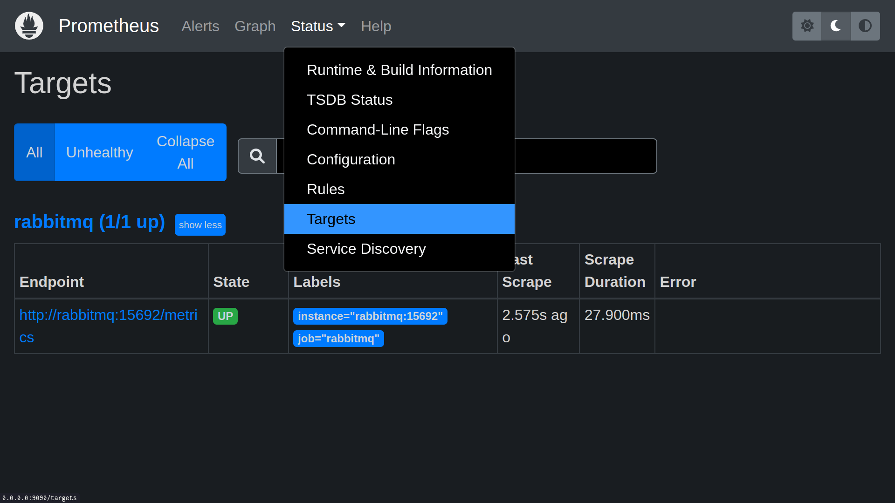
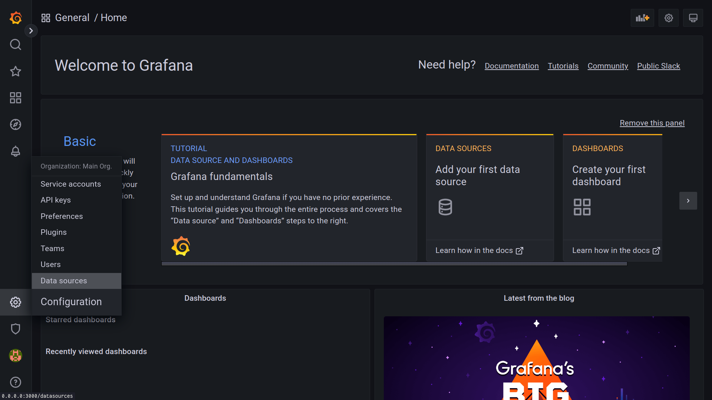
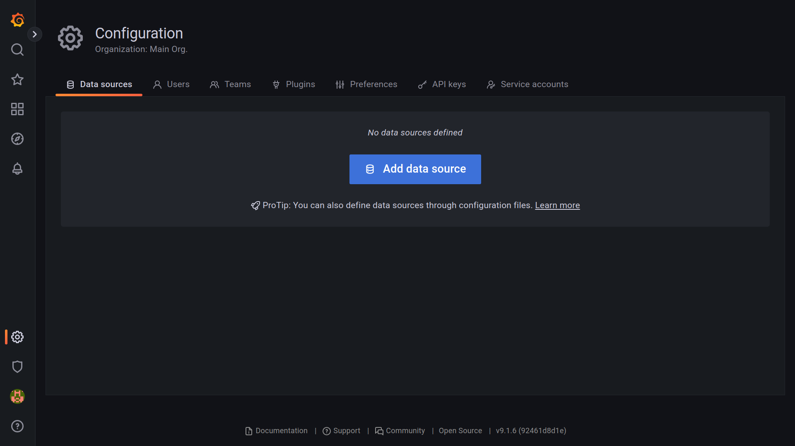
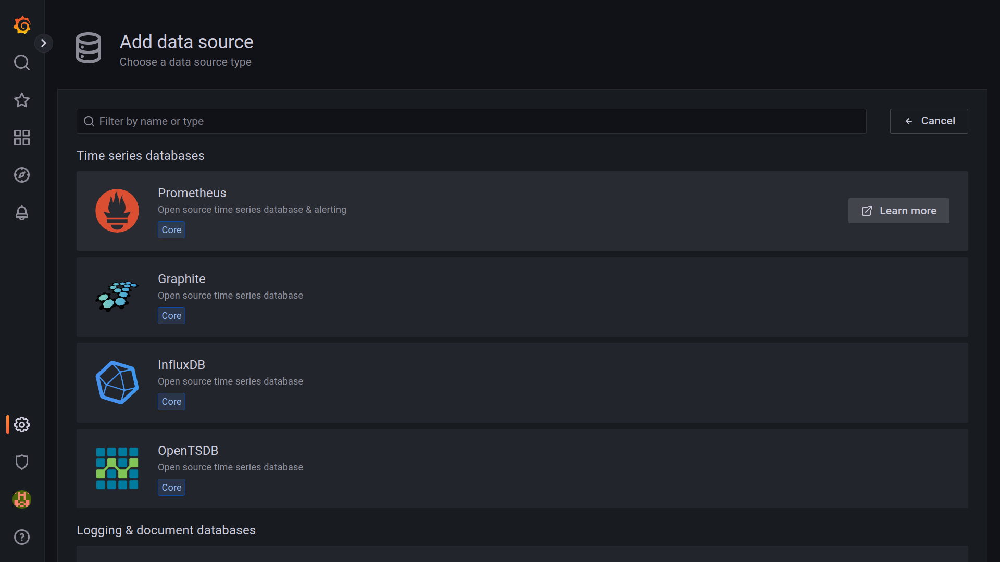
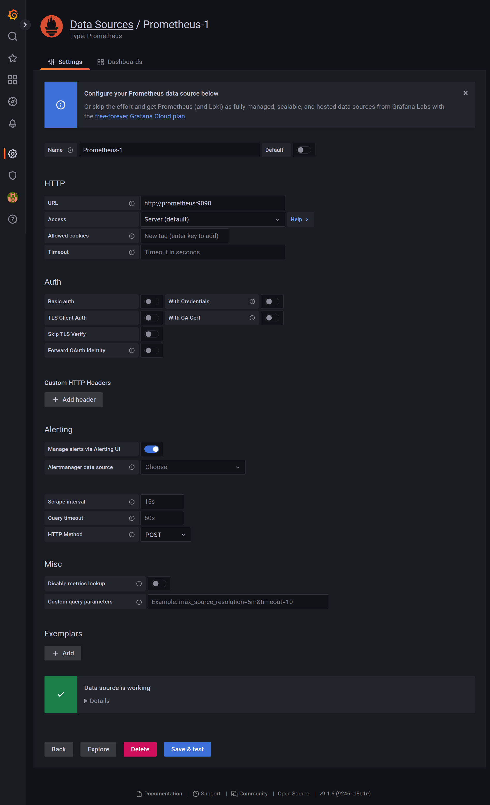
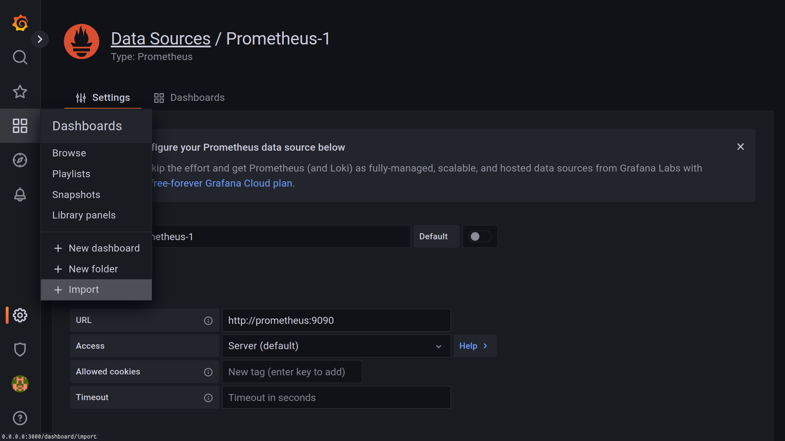
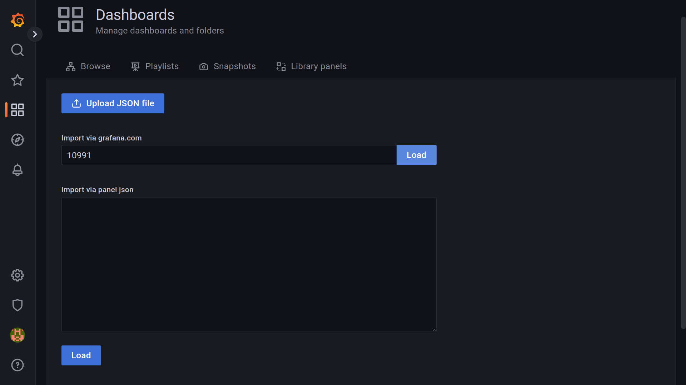
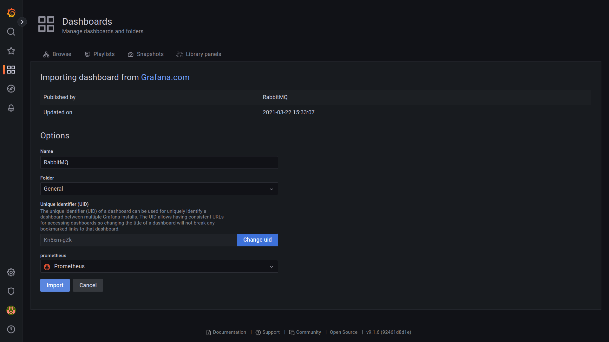
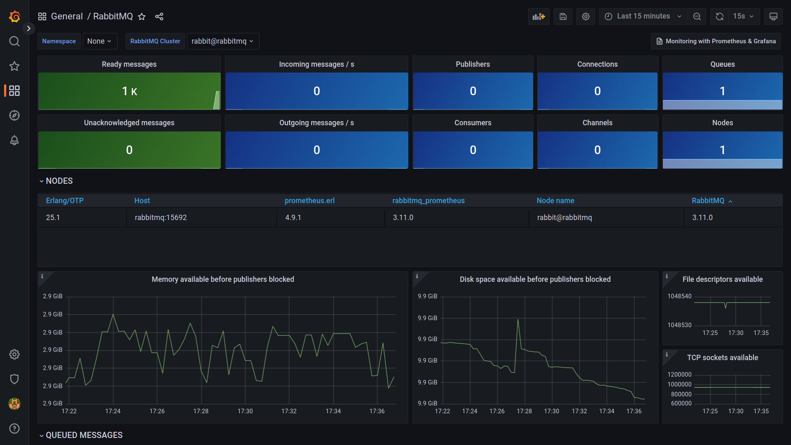

<p align="center">
  
</p>

# Golang + Rabbitmq

## Overview

This application sends and consumes messages using Message Broker Rabbitmq, along with the power that Golang gives us to deal with situations that we need high performance.

- [x] Rabbitmq to Produce and Consume Messages
- [x] Concurrency using Goroutines
- [x] Channels
- [x] SQLite Database
- [x] HTTP Server
- [x] Workers
- [x] Docker + Docker Compose

---

<details>
<summary>
  Setup Application
</summary>

### Install dependencies

```bash
$ go mod tidy
```

### Create database

The database is already created and available at `internal/order/infra/database/sqlite.db`, but if you want to create it from scratch, just follow these steps:

```bash
$ cd internal/order/infra/database
$ touch sqlite.db
```

Now you need to access the database and create the `orders` table:

```sql
CREATE TABLE orders (
  id VARCHAR(255) PRIMARY KEY NOT NULL,
  price FLOAT NOT NULL,
  tax FLOAT NULL,
  final_price FLOAT NOT NULL
)
```

### Rabbitmq

#### Create orders queue

1. Go to http://localhost:15672 and log in to the Rabbitmq Management using guest credentials, by default the user is `guest` and the password is `guest`.
2. Choose the `Queues` tab.
3. Expand the `Add a new queue` option and set the queue name to `orders`.
4. Click on `Add queue`.


#### Create bind

1. Choose the `Exchanges` tab.
2. Click on `amq.direct`.


3. Expand the `Bindings` option and define in `To queue` the name `orders`.
4. Click on `Bind`.


After creating the bind it will look like this


### Produce messages

For you to be able to test it, just produce some messages using the producer, it is configured to generate 1.000 messages that will be stored in the `orders` queue.

```bash
$ go run cmd/producer/main.go
```

### Consume messages

Now to finish, just consume these messages, this procedure will occur concurrently and all messages that are consumed will be stored in the SQLite database.

```bash
$ go run cmd/main.go
```

</details>

<details>
<summary>
  Setup Prometheus + Grafana (optional)
</summary>

### Run Prometheus + Grafana

The environments were configured using Docker Compose, to start the environment you must run:

```bash
$ docker-compose up
```

### Prometheus

#### Check Rabbitmq status

1. Go to http://localhost:9090.
2. Choose the `Status` option.
3. Click on `Targets`.

Make sure the `State` column is `UP`



### Grafana

#### Configure Rabbitmq Dashboard

1. Go to http://localhost:3000.
2. Click on the `Settings icon` and choose the `Data sources` option.



3. Click on `Add data source`.



4. Click on `Prometheus`.



5. Update `URL` field value to `http://prometheus:9090`.
6. Click on `Save & test`.



7. Click on the `Dashboard icon` and choose the `+ Import` option.



8. In the `Import via grafana.com` field, enter the value `10991` and click on the `Load` button.

> **10991** is the Rabbitmq Dashboard ID, you can get this and others from this link: https://grafana.com/grafana/dashboards



9. Select in the `prometheus` option the Prometheus that was configured there in the `Data source` section and click on the `Import` button, you can change the Dashboard name and the location where it will be saved as well.



Rabbitmq Dashboad



</details>
